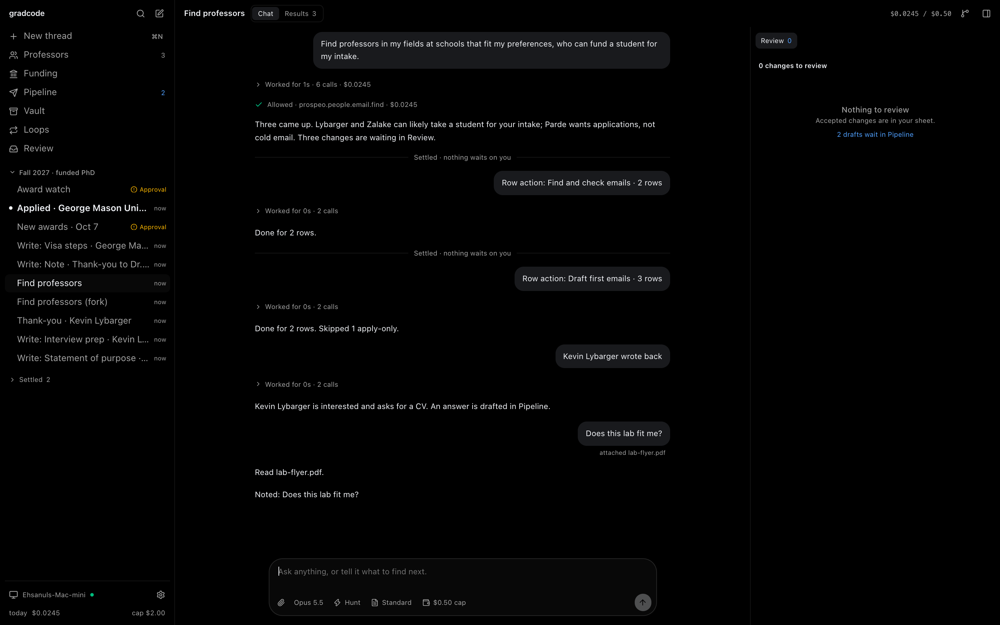
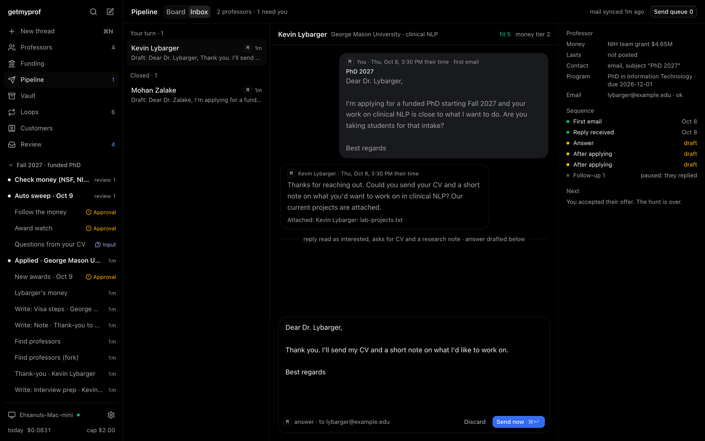
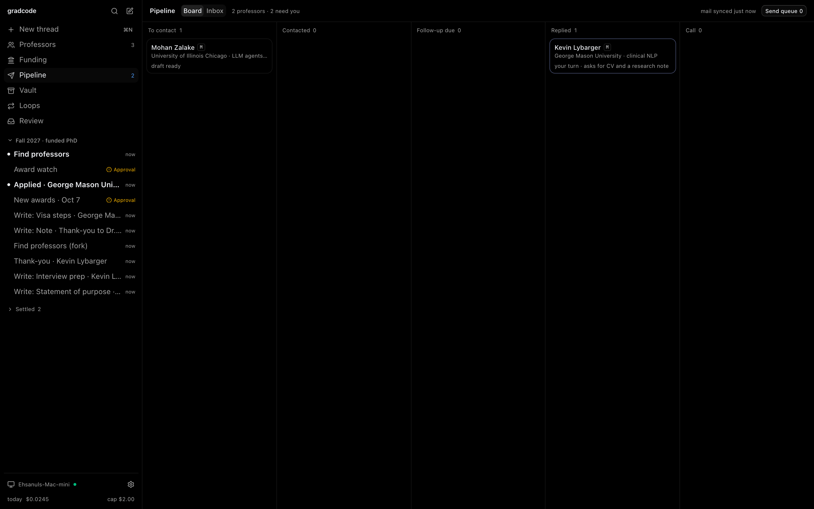
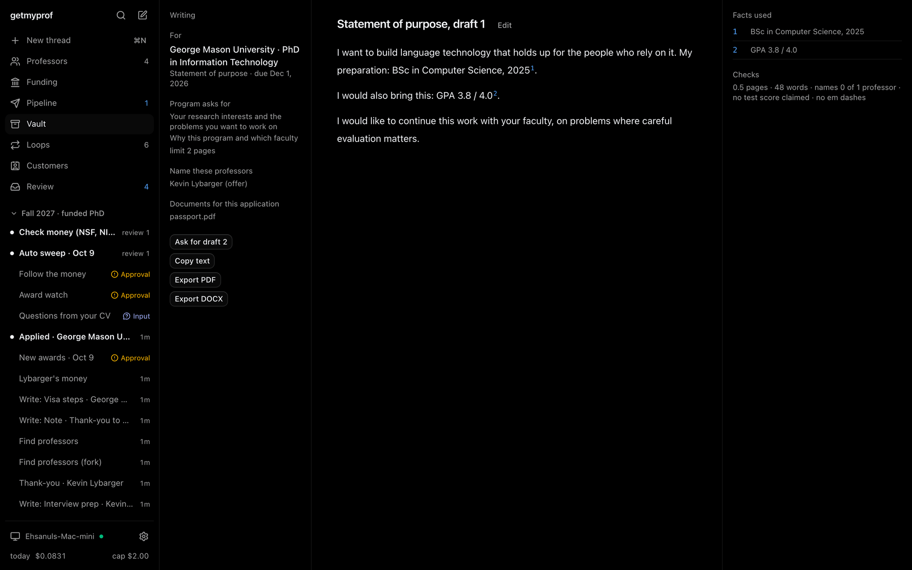
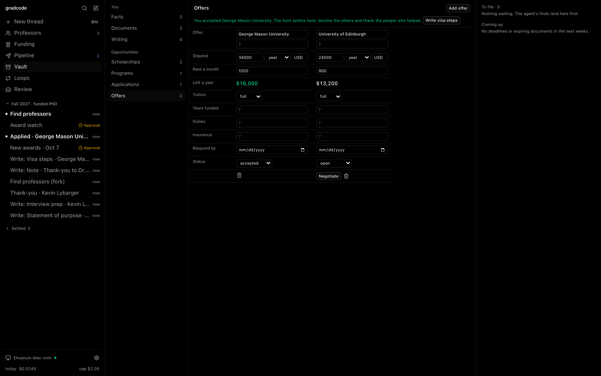
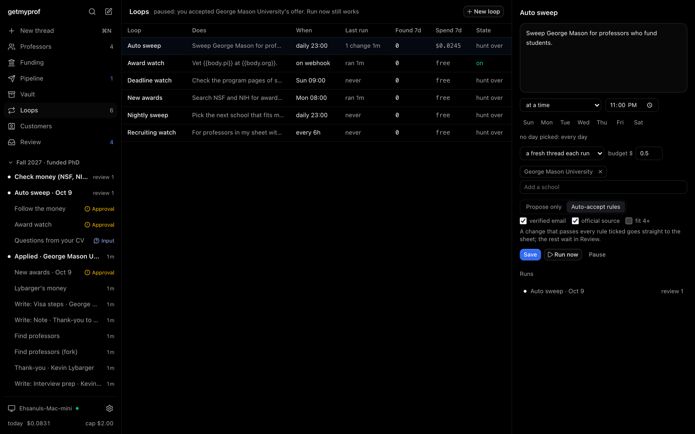

# gradcode

A T3 Code-shaped app for anyone hunting a funded degree. Every thread is a Claude Code session
on your own subscription, with free sources (NSF and NIH awards, UKRI, CORDIS and ARC grants,
OpenAlex, web search and faculty pages) and optional paid lookups through treg. It finds
professors who can fund you and the money behind them, then carries you through outreach,
applications and offers. Siam's install also reads hq and `~/Personal/gradhunt`, so Scout and the
cloud outreach routine keep working.

Design and the full spec, three required pages: the main spec
[docs/mocks/phase1.html](docs/mocks/phase1.html), the applicant's
[journey](docs/mocks/journey.html), and the
[Pipeline, Vault and Writer](docs/mocks/outreach-vault.html).

## Screenshots

Taken from the running app on the scripted agent (`GRADCODE_AGENT=fake`), so the data is fixtures.



| Pipeline inbox, by whose turn it is              | Pipeline board, by stage                      |
| ------------------------------------------------ | --------------------------------------------- |
|  |  |
| **Writer: every claim cites a fact**             | **Offers, compared after rent**               |
|            |         |



## What it does

| What                                                                                                                                                                                                                                                                                                                                                                                                                                               | Check                                                                                            |
| -------------------------------------------------------------------------------------------------------------------------------------------------------------------------------------------------------------------------------------------------------------------------------------------------------------------------------------------------------------------------------------------------------------------------------------------------- | ------------------------------------------------------------------------------------------------ |
| **First run.** Setup walks the hunt, your profile, eligibility and loops. The agent uses the Claude Code login already on the machine. Free sources need no keys; a treg key is optional.                                                                                                                                                                                                                                                          | A fresh install with no keys finishes setup and starts a hunt.                                   |
| **Profile from a CV.** The agent reads a CV and your profile links into facts, each with its source, and you confirm them. The agent, drafts and the Writer use only confirmed facts with proof. Siam's install reads hq.                                                                                                                                                                                                                          | A confirmed fact without proof never reaches the agent or an export.                             |
| **Hunt preferences.** Degree types, intake and fallback, places, fields and adjacent domains, funding floor, test waivers, what matters most, and your eligibility: citizenship, tests, GPA, fee budget, minimum stipend. Every turn and loop reads them.                                                                                                                                                                                          | Set the funding floor to full: every turn is told partly funded programs don't count.            |
| **Detail level.** Brief, Standard or Deep for the install: 6, 10 or 12 Results columns, and how much evidence the agent gathers.                                                                                                                                                                                                                                                                                                                   | Brief shows 6 columns; Deep adds Fits because and Sources.                                       |
| **Threads and the inbox sidebar.** Stream, stop, resume, fork, search; settle, snooze, auto-settle after 3 days; queue and steer; attach files. The agent asks you in Input when only you know. Runs on the host, so closing the laptop never stops a hunt.                                                                                                                                                                                        | End of day: every thread is settled, snoozed or working.                                         |
| **Results and row actions.** Every thread has a Results grid. Select rows, or all of them, and run Find and check emails, Check money, Taking students? or Draft first emails from the dock; cells fill in place with what they cost.                                                                                                                                                                                                              | Select 3 rows, Find and check emails: it asks first, and three Email cells fill with their cost. |
| **Records and Review.** Field diffs, and nothing is accepted without you. Accepting writes the local store; on Siam's install, changes to gradhunt's rows also go through `scout.py set`. A rejected new professor never comes back.                                                                                                                                                                                                               | Reject a professor; the next sweep doesn't propose them again.                                   |
| **Finders and pages.** Professor finder; funding finder over NSF, NIH, UKRI, CORDIS and ARC with the months left after your intake; professor pages with their sources.                                                                                                                                                                                                                                                                            | Every award in Funding shows how long it lasts after your intake.                                |
| **Loops.** Every N hours, at a time on chosen weekdays, or on a webhook whose JSON fills the instructions. Each run gets a fresh thread or goes back to one; run now or pause. A loop's budget caps each run.                                                                                                                                                                                                                                      | A nightly sweep runs with the laptop closed and waits in the morning.                            |
| **Spend you control.** Every paid call is priced and logged at what it really cost; calls over $0.01 ask; caps per thread, per loop run and per day, which treg enforces per call. A thread over a cap carries on with free sources; a loop run stops and says why.                                                                                                                                                                                | A loop run at its cap ends with "Stopped: This would pass the $0.5 cap for this loop run."       |
| **Paid lookups, billed per customer.** Each install holds a treg token pinned to its customer. Every call is tagged with the customer, hunt and feature by the server; Settings shows this month's spend. The issuer mints tokens, sets caps and invoices from treg's ledger with one script.                                                                                                                                                      | Connect a token: a lookup's cost shows in Settings and on treg's invoice for that customer.      |
| **Pipeline.** Your own mailbox (IMAP and SMTP with an app password) or your mail app. Drafts cite your facts and fit the professor's money tier; one with an unproven or uncited claim, a third link or an unchecked address waits for a fix. Sends go Tuesday to Thursday at 08:00 the professor's time within warm-up caps; follow-ups at +7 and +14 business days; replies come back to the thread and update the record. LinkedIn is assisted. | Add "I led a team of five." to a draft: it can't be sent until you cite a fact or cut it.        |
| **Vault and Writer.** Facts with proof, documents with expiry, scholarships, programs, applications and a To file inbox. The Writer drafts statements, CVs and essays citing your facts; an unproven claim, or one that cites nothing, blocks export to text, PDF or Word.                                                                                                                                                                         | Unconfirm a cited fact: export turns off until it has proof.                                     |
| **After applying.** Interview prep packs, calendar files and thank-yous; offers compared after rent; negotiation letters; visa steps; reminders and thanks for recommenders.                                                                                                                                                                                                                                                                       | Two offers side by side: the one leaving more after a year of rent is marked best.               |
| **MCP both ways.** Other agents drive gradcode at `/api/mcp` with a token. Your own MCP servers join every session and ask before each call unless you trust them.                                                                                                                                                                                                                                                                                 | Paste the config from Settings into another agent and search the sheet.                          |
| **Your data stays yours.** One local SQLite file. A full backup of every table and Vault file downloads and restores in one click; professors also export and import as CSV. gradcode sends no telemetry.                                                                                                                                                                                                                                          | Download a backup, wipe, restore: nothing lost.                                                  |
| **Polish bar.** T3 Code's feel: ⌘K jumps to any view, thread or professor and searches what was said; j/k, s, e, a/r and composer shortcuts; one-shot motion, nothing animates forever. On a phone, open the tailnet link or scan its QR code in Settings.                                                                                                                                                                                         | Triage the thread list without the mouse.                                                        |

**Not yet**, against the original spec: a detail level per thread (the thread toggle sets the
install's); setup detecting the Claude Code login (a missing one shows on the first turn); a
source link on every field of a professor page; loop scope and autonomy settings; ⌘K actions
(approvals, row actions and Pipeline approval need the mouse); `scout.py add` and `exclude` on
Siam's install; schools per sweep, which is stored but unused; Gmail sign-in.

**By design:** no hosted service, no native phone app, no providers other than Claude, no shared
hunts. On Siam's install, gradhunt's own rows stay with its cloud outreach routine.

## Shape

Built like T3 Code: a pnpm monorepo on Vite+ (`vp` for lint, format, test and staged hooks),
TypeScript 7, React 19 with the React Compiler, TanStack Router, Zustand, Base UI with T3 Code's
`components/ui` kit (MIT, notice kept), Tailwind v4, lucide icons and zod contracts. A local Node
server runs the agent sessions, loops and the send queue; everything lives in one SQLite file
under `~/.gradcode`. How the pieces fit: [docs/internals/overview.md](docs/internals/overview.md).

## Run it

Needs Node 24+, pnpm and tmux.

```sh
pnpm install
scripts/dev-local.sh up      # server :4311 + web http://127.0.0.1:5174, in tmux
scripts/dev-local.sh share   # open it from your phone over Tailscale
scripts/dev-local.sh down

# tests: unit, then e2e on a fresh stack with the scripted agent (free, deterministic)
pnpm test
scripts/dev-local.sh down
rm -rf /tmp/gc-e2e && GRADCODE_HOME=/tmp/gc-e2e GRADCODE_AGENT=fake scripts/dev-local.sh up
pnpm e2e
```

Agents start at [AGENTS.md](AGENTS.md).
